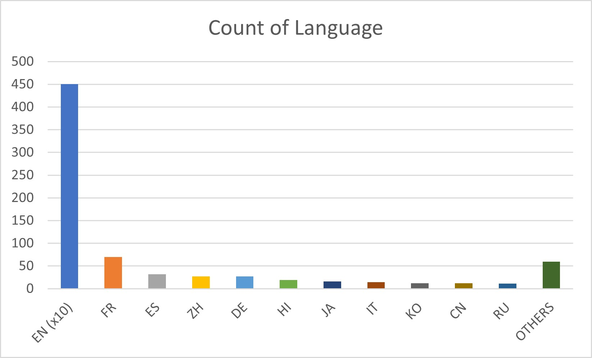

# Movie Recommendation System

I have created a content-based based movie recommendation system, which is inspired from many open-source projects. 

<h2>
Problem Statement
</h2>

    Recommend movies based on similar content. Similar content means similarity in cast, crew, movie title, genres, and other aspects.

<h2>
Dataset
</h2>

TMDB 5000 Movie Dataset

Source: <a href="https://www.kaggle.com/datasets/tmdb/tmdb-movie-metadata">TMDB Kaggle</a>

<h2>
Flow of implementation
</h2>
<ol>
<li>
    Studied about the dataset from the source.
</li>
<li>
    Analyzed attributes and their influence factor.
</li>
<li>
    Created a new feature from the attributes with influencing factor.
</li>
<li>
    Extracted numerical embeddings of the textual feature created.
</li>
<li>
    Calculated a similarity matrix using cosine similarity.
</li>
<li>
    For a given movie, extract the 6 nearest (similar) movies using the similarity score obtained.
</li>
<li>
    Return (represent) the similar movies found.
</li>
</ol>

 

    Still step 6 of the above implementation plan, my raw work can be found in Movie_Recommendation.ipynb file.

<h2>
    1. About the Dataset
</h2>

    The dataset is having two portions: tmdb_5000_movies.csv and tmdb_5000_credits.csv

    Following are the attributes present in the csv files:

<table>
    <tr>
        <th>
            tmdb_5000_movies
        </th>
        <th>
            tmdb_5000_credits
        </th>
    </tr>
    <tr>
        <td>
            budget: numeric value
        </td>
        <td>
            movie_id: numeric value
        </td>
    </tr>
    <tr>
        <td>
            genre: stringed_json
        </td>
        <td>
            title: string
        </td>
    </tr>
    <tr>
        <td>
            homepage: stringed_url
        </td>
        <td>
            cast: stringed_json
        </td>
    </tr>
    <tr>
        <td>
            id: numeric value
        </td>
        <td>
            crew: stringed_json
        </td>
    </tr>
    <tr>
        <td>
            original_title: string
        </td>
        <td>
        </td>
    </tr>
    <tr>
        <td>
            popularity: numeric value
        </td>
        <td>
        </td>
    </tr>
    <tr>
        <td>
            production_companies: stringed_json
        </td>
        <td>
        </td>
    </tr>
    <tr>
        <td>
            production_countries: stringed_json
        </td>
        <td>
        </td>
    </tr>
    <tr>
        <td>
            release_date: date
        </td>
        <td>
        </td>
    </tr>
    <tr>
        <td>
            revenue: numeric value
        </td>
        <td>
        </td>
    </tr>
    <tr>
        <td>
            runtime: numeric value (in minutes)
        </td>
        <td>
        </td>
    </tr>
    <tr>
        <td>
            spoken_language: stringed_json
        </td>
        <td>
        </td>
    </tr>
    <tr>
        <td>
            status: string
        </td>
        <td>
        </td>
    </tr>
    <tr>
        <td>
            tagline: string
        </td>
        <td>
        </td>
    </tr>
    <tr>
        <td>
            title: string
        </td>
        <td>
        </td>
    </tr>
    <tr>
        <td>
            vote_average: numeric value
        </td>
        <td>
        </td>
    </tr>
    <tr>
        <td>
            vote_count: numeric value
        </td>
        <td>
        </td>
    </tr>
</table>

    As the information in the tmdb_5000_credits.csv like 'cast' and 'crew' is required for further analysis, I merged both the dataframes into one. 

    <b>CODE:</b>

<code>
    MOVIE_CSV = r"Dataset/tmdb_5000_movies.csv"
    CREDITS_CSV = r"Dataset/tmdb_5000_credits.csv"
</code>
<code>
    movies = pd.read_csv(MOVIE_CSV)
    credits = pd.read_csv(CREDITS_CSV)
</code>

    I am merging both the dataframes based on 'title' as title is unique for all possible movies in this case.

<code>
    merged_movies = movies.merge(credits, on='title')
</code>

<h2>
    2. Analysis of attributes
</h2>

    Attributes considered for recommendation system build-up are in <b>bold</b> font.

    i) budget: As it depicts the price of making a movie, usually a high budget film may attract good ratings. Being a numeric value, I will not use in my recommendation system.

    ii) <b>genres</b>: Depicts type of the movie. Used for recommendation as it helps to find the similar movie.

    iii) homepage: Not required as it not helps in finding similar movie. A URL is always unique.

    iv) movie_id: I have not used this but it is required for fetching the movie related information. This movie_id is provided by the TMDB.

    v) <b>keywords</b>: Useful for finding the similarity between the movies, as these words are often remembered by the users.

    vi) original_language: May affect if also look for region of the user. In this case, we are only considering the content of the movie, hence not taken into the account.

    vii) original_title: There may be multiple language, and here I am handling the cases for only one language, i.e. English. Hence, skipping this at the moment.

    viii) <b>overview</b>: This contains the summary of the movie. This information is necessary to consider as it kind of characterizes the movie.

    ix) popularity: Gives a popularity factor, higher value means more popularity. This attribute currently don't align with my textual only content-based approach, hence, not considered.

    x) production_companies: This information naturally doesn't characterize the movie, hence not used.

    xii) production_countries: Same reason as not using the production_companies.

    xiii) release_date: Some people might like the movies from a particular era, in that sense release date do matter. But right now, I am not considering the release date.

    xiv) revenue: Naturally cannot depict the similarity between the movies.

    xv) runtime: Cannot be considered to measure the likliness between the movies.

    xvi) spoken_languages: As the regional factor is naturally correlated with the spoken language, I am not consider the spoken language.

    xvii) status: It is very optional factor, usually, this dataset contains mostly the publicly available movies on several platforms, hence, this attribute do not provide any help.

    xviii) tagline: It depicts the motto of the movie, and that is not enough because the poetic meaning of a movie may mislead the recommendation system.

    xix) <b>title</b>: This is the English version of the original_title, hence, I have used this in my recommendation system.

    xx) vote_average and vote_count: Not considered for recommendation as these are numeric values. Although a complex recommendation system can also intake the numerical factors.

    xxi) <b>cast</b>: Generally the cast, i.e., actors of the movie do influence the people's choice of watching a movie.

    xxii) <b>crew</b>: Some crew members like director, do influence on the characteristics of the movie.

    Below is the visualization of count of languages present in the dataset:

    Above, it is clearly visible that the dataset contains a majority amount of English movies, hence, consider the movie language or region will create a possible biasness in the recommendation. Therefore, to avoid such scenario, I have not used the language and region factor.

    I have then created a different dataframe in which stores only the attributes required for recommendation.

<code>
    extracted_movies_features = merged_movies[['movie_id', 'title', 'overview', 'genres', 'keywords', 'cast', 'crew']]
</code>

<h2>
    3. Data cleaning and feature extraction
</h2>

    Checked for any possible null values:

<code>
    extracted_movie_features.isnull().sum()
</code>

    Found only 3 null values in the overview, hence I dropped the null values.

<code>
    extracted_movie_features.dropna(inplace=True)
</code>

<b>
    Processing 'genres'
</b>

    The genres attribute has values in the following form: '[{"id": 28, "name": "Action"}, . . .]'

    It is an array of dictionary that too in string. In order to resolve this, I used a library named <a href="https://docs.python.org/3/library/ast.html">ast</a>.

    Extracting the "name" field from the dictionary:

<code>
    def extract_values_from_list(list_of_dictionary, key='name'):

        result = []

        if type(list_of_dictionary)==type('as'):

            # literal_eval is the method of ast to use in order to get the string having list of specific values to it's desired form

            list_of_dictionary = ast.literal_eval(list_of_dictionary)

        for item in list_of_dictionary:

            result.append(item[key])

        return result

</code>

    Using above code, I extracted only the names containing the genre information.

    Similarly, the attributes 'keywords', 'cast' and 'crew' were processed (a bit differently, that can be seen in Movie_Recommendation.ipynb file) and converted into a list of keywords.

